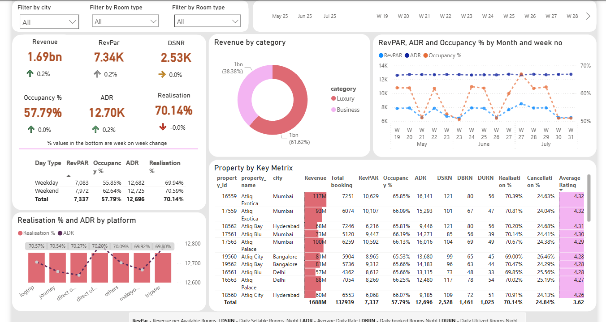

# 🏨 Hospitality Revenue Analysis Dashboard

A data-driven business intelligence dashboard to help AtliQ Grands reclaim their market position in the Indian hospitality industry by optimizing pricing, understanding customer behavior, and identifying revenue leakages.

---

## 📖 Project Background: The Business Story

### 📌 **Problem Statement**

AtliQ Grands, a prestigious chain of five-star hotels across India, has been facing **declining revenue and market share** in both the luxury and business segments. With **increased competition** and **inefficient decision-making**, their management identified the need for **Business Intelligence** to guide their strategic initiatives.

However, lacking an internal analytics team, they outsourced this critical task to a data service provider.

---

### 🎯 **Your Task as a Data Analyst**

This project is part of the [Codebasics Resume Project Challenge – Hospitality Domain](https://codebasics.io/challenges/codebasics-resume-project-challenge/4).  
Dataset and project brief are sourced from the same platform.

You were hired to:

1. **Develop key metrics** that reflect the performance of the hotel properties.
2. **Build an insightful Power BI dashboard** based on a stakeholder-approved mock-up.
3. **Derive additional insights** beyond the metric list to support business decisions and competitive advantage.

---

## 📸 Dashboard Screenshot



---

## 📁 Data Model Overview

Data consists of 5 tables structured in a star schema:

| Table Name                  | Type       | Description                                                           |
|----------------------------|------------|-----------------------------------------------------------------------|
| `dim_date`                 | Dimension  | Dates, day types, week numbers for May–July                          |
| `dim_hotels`               | Dimension  | Hotel properties including `category`, `city`                        |
| `dim_rooms`                | Dimension  | Room types and room class                                            |
| `fact_aggregated_bookings`| Fact       | Room-level booking summary by date and hotel                         |
| `fact_bookings`            | Fact       | Individual booking details including `status`, `platform`, `revenue` |

---

## 📊 Metrics & KPIs

25+ DAX measures were created to evaluate:

- 📈 **Revenue**, **RevPAR**, **ADR**
- 🏨 **Occupancy %**, **Capacity**, **Realisation %**
- ❌ **Cancellations**, **No Show rate**
- 📅 **Week-over-Week trends**
- 📊 **Platform & Room Class Contributions**

---

## 📈 Dashboard Highlights

- **KPI Cards**: Revenue, ADR, RevPAR, Occupancy %, Realisation %, DSNR
- **Line Chart**: Weekly trends of RevPAR, ADR & Occupancy
- **Donut Chart**: Revenue by Hotel Category
- **Bar + Line Chart**: ADR and Realisation by Booking Platform
- **Matrix Table**: Property-level deep dive
- **Slicers**: Filter by City, Room Type, Date
---

## 📐 DAX Measures Used


#### 💰 Revenue & Booking Metrics

- **Revenue**  
  → Sum of all revenue collected from successful bookings.

- **Total Bookings**  
  → Count of all booking transactions recorded.

- **Total Capacity**  
  → Total number of rooms available across all hotels.

- **Total Successful Bookings**  
  → Total rooms that were actually booked and utilized.

- **Occupancy %**  
  → (Total Successful Bookings ÷ Total Capacity) × 100

- **Average Rating**  
  → Average rating score given by customers after stay.

- **No. of Days in Data**  
  → Total number of days between first and last booking (May–July = 92 days).

#### ❌ Cancellation & No Show Metrics

- **Total Cancelled Bookings**  
  → Number of bookings with status marked as "Cancelled".

- **Cancellation %**  
  → (Cancelled Bookings ÷ Total Bookings) × 100

- **Total No-Show Bookings**  
  → Number of bookings where customer neither cancelled nor checked in.

- **No-Show Rate %**  
  → (No-Show Bookings ÷ Total Bookings) × 100

- **Total Checked Out**  
  → Number of customers who successfully completed their stay.

- **Realisation %**  
  → 100% – (Cancellation % + No-Show Rate %)

#### 📊 Booking Contribution Metrics

- **Booking % by Platform**  
  → Booking share of each platform out of total bookings.

- **Booking % by Room Class**  
  → Room class share out of total rooms booked.

#### 💵 Pricing Metrics

- **ADR (Average Daily Rate)**  
  → Revenue ÷ Total Bookings

- **RevPAR (Revenue Per Available Room)**  
  → Revenue ÷ Total Room Capacity

- **DBRN (Daily Booked Room Nights)**  
  → Total Bookings ÷ No. of Days

- **DSRN (Daily Sellable Room Nights)**  
  → Total Room Capacity ÷ No. of Days

- **DURN (Daily Utilized Room Nights)**  
  → Checked Out Bookings ÷ No. of Days

#### 📈 Week-over-Week (WoW) Performance Metrics

- **Revenue WoW Change %**  
  → ((Current Week Revenue – Previous Week Revenue) ÷ Previous Week Revenue) × 100

- **Occupancy WoW Change %**  
  → ((Current Week Occupancy – Previous Week Occupancy) ÷ Previous Week Occupancy) × 100

- **ADR WoW Change %**  
  → ((Current Week ADR – Previous Week ADR) ÷ Previous Week ADR) × 100

- **RevPAR WoW Change %**  
  → ((Current Week RevPAR – Previous Week RevPAR) ÷ Previous Week RevPAR) × 100

- **Realisation WoW Change %**  
  → ((Current Week Realisation % – Previous Week Realisation %) ÷ Previous Week Realisation %) × 100

- **DSRN WoW Change %**  
  → ((Current Week DSRN – Previous Week DSRN) ÷ Previous Week DSRN) × 100
---

## 🔍 Insights & Recommendations

### 1. 📆 **Static Pricing Between Weekdays & Weekends**
- *Insight*: ADR and Realisation % are nearly equal for weekdays and weekends.
- *Action*: **Dynamic pricing** can help monetize high-demand weekends more effectively.

---

### 2. 🛡️ **Price Shielding via Private Offers**
- *Insight*: Visible public discounts are vulnerable to scraping by OTA bots.
- *Action*: Offer **hidden coupons** and loyalty-based pricing to avoid exposing strategy to competitors.

---

### 3. 💸 **Luxury Drives Revenue, Not Volume**
- *Insight*: 62% of revenue comes from Luxury hotels despite fewer properties.
- *Action*: **Upsell** from Business to Luxury using package deals or bundled experiences.

---

### 4. ❌ **Cancellations & No-Shows Are Platform-Specific**
- *Insight*: Platforms like *Tripster* show lower Realisation %, indicating higher booking drop-offs.
- *Action*: Optimize OTA partnerships or enforce stricter cancellation policies for certain platforms.

---

### 5. 🏆 **Mumbai & Hyderabad Are Top Performers**
- *Insight*: Properties in these cities consistently outperform in RevPAR and Occupancy.
- *Action*: Use them as **benchmark properties** to replicate success across the chain.

---

## 🧰 Tools Used

- Power BI Desktop
- DAX for complex KPIs
- CSV files for mock data
- Star Schema modeling

---

## 🗂️ Project Structure

```bash
📁 hospitality-revenue-analysis/
│
├── 📁 Dataset/                          # Raw and supporting data files
│   ├── 📁 Input Files/                  # All input CSV, Excel, and reference files
│   │   ├── dim_date.csv
│   │   ├── dim_hotels.csv
│   │   ├── dim_rooms.csv
│   │   ├── fact_aggregated_bookings.csv
│   │   ├── fact_bookings.csv
│   │   ├── meta_data_hospitality.txt
│   │   ├── metrics list.xlsx
│   │   └── mock up dashboard_atliq grands.png
│
├── 📁 Visualisation/                   # Power BI dashboard
│   └── Hospitality revenue analysis Dashboards.pbix
│
├── 📸 Dashboard_screenshot.png         # Screenshot of the dashboard
│
└── 📄 README.md                        # Project overview (you are here)
````

---

## 🚀 Future Enhancements

* Predictive pricing using ML models
* Customer segmentation based on booking behavior
* Real-time data integration
* Automated alerts for occupancy drops or revenue dips